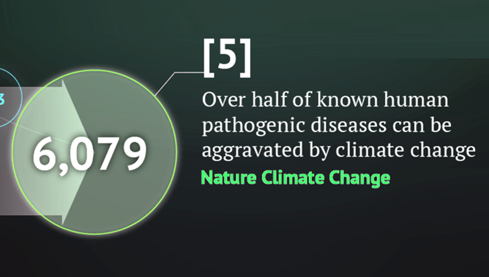
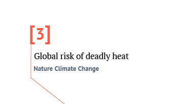
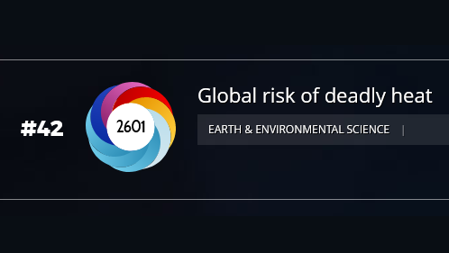
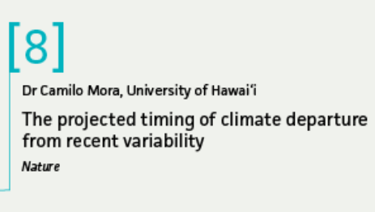

# Publications {-}

  
  |                                                                                             |
  | :--------------------------- | :----------------------------------------------------------- |
  | **Lab hits**                                                                                    |
  |           |<a href="Publications/Mora 078.pdf">Disease paper</a>   **Ranked 5th most influential climate paper of 2022**    by [Carbon Brief](https://www.carbonbrief.org/analysis-the-climate-papers-most-featured-in-the-media-in-2022/)
  |              |<a href="Publications/Mora 059.pdf">Heatwave paper</a>   **Ranked 3th most influential climate paper of 2017**    by [Carbon Brief](https://www.carbonbrief.org/analysis-the-climate-papers-most-featured-in-the-media-in-2017/)                            
  |          |<a href="Publications/Mora 059.pdf">Heatwave paper</a>   **Among top 100 most influential papers of 2017**    by [Altmetric](https://www.altmetric.com/top100/2017/#list) 
  |              |[Climate departure paper](/Publications/Mora 038.pdf)   **Ranked 8th most influential climate paper of 2013**    by [Carbon Brief](https://www.carbonbrief.org/media/427547/altimetric-1a.png) 
  |           |[Climate departure paper](/Publications/Mora 038.pdf)   **Among top 100 most influential papers of 2013**    by [Altmetric](https://www.altmetric.com/top100/2013/)  
  |   |[Number of species paper](https://github.com/Camilo-Mora/MoraLab/tree/main/Publications/Mora 001.pdf)   **Among top 100 most influential papers of 2011**    by [Discover magazine](https://www.discovermagazine.com/2012/jan-feb/63) 

.

|                                                                                                                                                                                                                                         |
|:--|-------------------------------------------------------------------------------------------------------------------------------------------------------------------------------------------------------------------------------------|

| 77| Lohrey S, Mora C, Reckien D, Creutzig FS (2021) Deadly Heat Exposure in an Urbanized World,EarthArXiv.
|   |
| 76| McDowell K, Zhong Y, Webster K, Gonzalez HJ, Trimble AZ, Mora C (2021) Comprehensive temperature controller with internet connectivity for plant growth experiments, *HardwareX*, 10, e00238 [PDF](/Publications/Mora 001.pdf)  
|   |
| 75| Beyer R, Manica A, Mora C (2021) Shifts in global bat diversity suggest a possible role of climate change in the emergence of SARS-CoV-1 and SARS-CoV-2. Science of The Total Environment, 767, 145413 (URL) (PDF)
|   |
| 74| Takara G, Trimble Z, Arata R, Brown S, Gonzalez J, Mora C (2021) An inexpensive robotic gantry to screen and control soil moisture for plant experiments. *HardwareX*, 9, e00174
|   |
| 73| Mora Rollo A, Rollo A, Mora C (2020) The tree-lined path to carbon neutrality. Nature Reviews Earth & Environment, 1, 332
|   |
| 72| Cruz‐Motta JJ, Miloslavich P, Guerra‐Castro E, Hernández‐Agreda A, Herrera C, Barros F, Navarrete SA, Sepúlveda RD, Glasby TM, Bigatti G, Cardenas‐Calle M, Carneiro PB, Carranza A, Flores AA, Gil‐Kodaka P, Gobin J, Gutiérrez JL, Klein E, Krull M, Lazarus JM, Londoño‐Cruz E, Lotufo T, Macaya RS, Mora C, Mora E, Palomo G, Parragué M, Pellizzari F, Retamales R, Rocha RM, Romero L (2020) Latitudinal patterns of species diversity on South American rocky shores: Local processes lead to contrasting trends in regional and local species diversity. Journal of Biogeography, 1, 10.1111/jbi.13869 
|   |
| 71| Cinner JE, Zamborain-Mason J, Gurney GG, Graham NA, MacNeil MA, Hoey AS, Mora C, Villéger S, Maire E, McClanahan TR, Maina JM. (2020) Meeting fisheries, ecosystem function, and biodiversity goals in a human-dominated world. Science, 368, 307:311 (URL) (PDF)
|   |
| 70| Thiault L, Mora C, Cinner J, Cheung W, Graham N, Januchowski-Hartley F, Mouillot D, Sumaila R, Claudet J (2019) Escaping the perfect storm of simultaneous climate change impacts on agriculture and marine fisheries. Science Advances, 5, eaaw9976 (URL) (PDF)
|   |
| 69| Raymond C, Coumou D, Foreman T, King A, Perkins- Kirkpatrick S, Kornhuber K, Lesk C, Mora C , Russo S, Vijverberg S (2019) Projections and hazards of future extreme heat. In Pfeffer, et al (ed) The Oxford Handbook of Planning for Climate Change Hazards. Oxford University Press. p 1-42. (URL) (PDF)
|   |
| 68| Mora C, Rollins RL, Taladay K, Kantar MB, Chock MK, Shimada M, Franklin EC (2019) Problems with Bitcoin emmision calculations. Nature Cliamte Change, 9, 658-659 (URL) (PDF)
|   |
| 67| Darling ES, McClanahan TR, Maina J, Gurney GG, Graham NAJ, Januchowski-Hartley F, Cinner JE, Mora C, Hicks CC, Maire E, Puotinen M, Skirving WJ, Adjeroud M, Ahmadia G, Arthur R, Bauman AG, Beger M, Berumen ML, Bigot L, Bouwmeester J, Brenier A, Bridge TCL, Brown E, Campbell SJ, Cannon S, Cauvin B, Chen CA, Claudet J, Denis V, Donner S, Estradivari, Fadli N, Feary DA, Fenner D, Fox H, Franklin EC, Friedlander A, Gilmour J, Goiran C, Guest J, Hobbs J-PA, Hoey AS, Houk P, Johnson S, Jupiter SD, Kayal M, Kuo C-y, Lamb J, Lee MAC, Low J, Muthiga N, Muttaqin E, Nand Y, Nash KL, Nedlic O, Pandolfi JM, Pardede S, Patankar V, Penin L, Ribas-Deulofeu L, Richards Z, Roberts TE, Rodgers KuS, Safuan CDM, Sala E, Shedrawi G, Sin TM, Smallhorn-West P, Smith JE, Sommer B, Steinberg PD, Sutthacheep M, Tan CHJ, Williams GJ, Wilson S, Yeemin T, Bruno JF, Fortin M-J, Krkosek M, Mouillot D (2019) Social–environmental drivers inform strategic management of coral reefs in the Anthropocene. Nature Ecology & Evolution, 3, 1341-1350 (URL) (PDF)
|   |
| 66| Mora C, Spirandelli D, Franklin EC, Lynham J, Kantar MB, Miles W, Smith CZ, Freel K, Moy J, Louis LV, Barba EW, Bettinger K, Frazier AG, Colburn Ix JF, Hanasaki N, Hawkins E, Hirabayashi Y, Knorr W, Little CM, Emanuel K, Sheffield J, Patz JA, Hunter CL (2018) Broad threat to humanity from cumulative climate hazards intensified by greenhouse gas emissions. Nature Climate Change, 10.1038/s41558-018-0315-6 (URL) (PDF) (Hazards) (Impacts) (Individual hazard animations)
|   |
| 65| Mora C, Rollins RL, Taladay K, Kantar MB, Chock MK, Shimada M, Franklin EC (2018) Bitcoin emissions alone could push global warming above 2°C. Nature Climate Change 8, 931-933 (PDF)
|   |
| 64| Geronimo RC, Franklin EC, Brainard RE, Elvidge CD, Santos MD, Venegas R, Mora C (2018) Mapping fishing activities and suitable fishing grounds using nighttime satellite images and maximum entropy modelling. Remote Sensing 10, 1604 (URL) (PDF)
|   |
| 63| Mora C. (2018) Autonomous programmable plant watering device. US Pattent & Trademark Office, US20180220602A1 (URL) (PDF)
|   |
| 62| Cinner JE, Maire E, Huchery C, MacNeil MA, Graham NAJ, Mora C, McClanahan TR, Barnes ML, Kittinger JN, Hicks CC, D'Agata S, Hoey AS, Gurney GG, Feary DA, Williams ID, Kulbicki M, Vigliola L, Wantiez L, Edgar GJ, Stuart-Smith RD, Sandin SA, Green A, Hardt MJ, Beger M, Friedlander AM, Wilson SK, Brokovich E, Brooks AJ, Cruz-Motta JJ, Booth DJ, Chabanet P, Gough C, Tupper M, Ferse SCA, Sumaila UR, Pardede S, Mouillot D. (2018) Gravity of human impacts mediates coral reef conservation gains. Proceedings of the National Academy of Sciences USA 115, E6116:E6125 (URL) (PDF)
|   |
| 61| Needham MD, Szuster BW, Lesar L, Mora C, Knecht DP (2018) Snorkeling and scuba diving with manta rays: encounters, norms, crowding, satisfaction, and displacement. Human Dimensions of Wildlife 1, 1:13 (URL) (PDF)
|   |
| 60| Mora C, Counsell CW, Bielecki CR, Louis L (2017) Twenty-seven ways a heat wave can kill you: Deadly heat in the era of climate change. Circulation: Cardiovascular Quality and Outcomes 10, e004233 (URL) (PDF)
|   |
| 59| Mora C, Dousset B, Caldwell IR, Powell FE, Geronimo RC, Bielecki CR, Counsell CW, Dietrich BS, Johnston ET, Louis L, Lucas MP, McKenzie MM, Shea AG, Tseng H, Giambelluca TW, Leon LR, Hawkins E, Trauernicht C (2017) Global risk of deadly heat. Nature Climate Change 7, 501-506 (URL) (PDF) (Data)
|   |
| 58| Crist E, Mora C, Engelman R (2017) The interaction of human population, food production, and biodiversity protection. Science 356, 260-264 (URL) (PDF)
|   |
| 57| Sweetman AK, Thurber AR, Smith CR, Levin LA, Mora C, Wei C, Gooday AJ, Jones D, Rex M, Yasuhara M, Ingels J, Ruhl HA, Frieder CA, Danovaro R, Wurzberg L, Baco A, Grupe BM, Pasulka L, Meyer KS, Dunlop KM, Henry LA, Roberts JM (2017) Major impacts of climate change on deep-sea benthic ecosystems. Elementa doi:10.1080/09669582.2016.1274319 (URL) (PDF)
|   |
| 56| Needhama MD, Szuster BW, Mora C, Lesar L, Ander E (2017) Manta ray tourism: interpersonal and social values conflicts, sanctions, and management. Journal of Sustainable Tourism doi:10.1080/09669582.2016.1274319 (URL) (PDF)
|   |
| 55| Scheffers BR, De Meester L, Bridge T, Hoffmann AA, Pandolfi J, Corlett R, Butchart S, Pearce-Kelly P, Kovacs K, Dudgeon D, Pacifici M, Rondinini C, Foden W, Martin TG, Mora C, Bickford D, Watson J (2016) The broad footprint of climate change from genes to biomes to people. Science 354, 719-720 (URL) (PDF)
|   |
| 54| Mora C, Graham NAJ, Nystrom M (2016) Ecological limitations to the resilience of coral reefs. Coral Reefs DOI 10.1007/s00338-016-1479-z (URL) (PDF)
|   |
| 53| Cinner J, Huchery C, MacNeil A, Graham N, McClanahan T, Maina J, Maire E, Kittinger J, Hicks C, Mora C, Allison E, DAgata S, Hoey A, Feary D, Crowder L, Williams I, Kulbicki M, Vigliola L, Wantiez L, Edgar G, Stuart-Smith R, Sandin S, Green A, Hardt M, Beger M, Friedlander A, Campbell S, Holmes K, Wilson S, Brokovich E, Brooks A, Cruz-Motta J, Booth D, Chabanet P, Gough C, Tupper M, Ferse S, Sumaila R, Mouillot D (2016) Bright spots among the worlds coral reefs. Nature 535, 416-419 (URL) (PDF)
|   |
| 52| Maire E, Cinner J, Velez L, Huchery C, Mora C, Dagata S, Vigliola L, Wantiez L, Kulbicki M, Mouillot D (2016) How accessible are coral reefs to people? A global assessment based on travel time. Ecology Letters 19: 351-360 (URL)(PDF)
|   |
| 51| Gilarranz L, Mora C, Bascompte J (2016) Anthropogenic effects are associated with a lower persistence of marine food webs. Nature Communications 7: 10737 (URL) (PDF)
|   |
| 50| Mora C, Caldwell IR, Birkeland C, McManus J (2016) Dredging in the Spratly Islands: gaining land but losing reefs. Plos Biology 14: e1002422 (URL)
|   |
| 49| Bartels P, Mora C (2016) A global biodiversity estimate of a poorly known taxon: Phylum Tardigrada. Zoological Journal of the Linnean Society 178, 730-736 (URL)
|   |
| 48| Mora C, Caldwell IR, Caldwell JM, Fisher MR, Genco BM, Running SW (2015) Disappearing suitable days for plant growth under projected climate change and potential human and biotic vulnerability. Plos Biology 13: e1002167. (URL)
|   |
| 47| Venegas-Li, Crosb A, White A, Mora C (2015) Measuring conservation success with missing Marine Protected Area boundaries: A case study in the Coral Triangle. Ecological Indicators  60, 119-124. (URL) (PDF)
|   |
| 46| Mora C (Editor) (2015) Ecology of Fishes on Coral Reefs. Cambridge University Press. (URL)
|   |
| 45| Mora C (2015) Perpetual struggle for conservation in a crowded world and the needed paradigm shift for easing ultimate burdens. In Mora C (ed) Ecology of Fishes on Coral Reefs. Cambridge University Press. p 289-296. (URL)
|   |
| 44| Mora C (2015) Large-scale patterns and processes in reef fish richness. In Mora C (ed) Ecology of Fishes on Coral Reefs. Cambridge University Press. p 88-96. (URL)
|   |
| 43| Mora C (2015) Limited functional redundancy and lack of resilience in coral reefs to human stressors. In Belgrano et al (ed) Aquatic Functional Biodiversity. Elsevier. p 115:126. (URL) (PDF)
|   |
| 42| Mora C, Danovaro R, Loreau M (2014) Alternative hypotheses to explain why biodiversity-ecosystem functioning relationships are concave-up in some natural ecosystems but concave-down in manipulative experiments. Scientific Reports 4: 5427. (URL)
|   |
| 41| Mora C, Frazier AG, Tong EJ, Longman RJ, Kaiser LR, Dacks RS, Walton MM, Fernandez-Silva I, Stender YO, Anderson JM, Sanchez JJ, Ambrosino CM, Giuseffi LM, Giambelluca TW (2014) Uncertainties in the timing of unprecedented climates. Nature 511: E5-E6. (URL) (PDF)
|   |
| 40| Mora C (2014) Revisiting the environmental and socioeconomic effects of population growth: a fundamental but fading issue in modern scientific, public, and political circles. Ecology and Society 19: 38. (URL)
|   |
| 39| Mora C, Rollo A, Amaro T, Baco AR, Billett D, Bopp L, Chen Q, Collier M, Danovaro R, Gooday AJ, Grupe BM, Halloran PR, Ingels J, Jones DOB, Levin LA, Nakano H, Norling K, Ramirez-Llodra E, Ruhl HA, Smith CR, Sweetman AK, Thurber AR, Tjiputra JF, Usseglio P, Watling L, Wei CL, Wu T, Yasuhara M (2013) Biotic and human vulnerability to projected changes in ocean biogeochemistry over the 21st century. Plos Biology 11: e1001682. (URL)
|   |
| 38| Mora C, Frazier AG, Tong EJ, Longman RJ, Kaiser LR, Dacks RS, Walton MM, Fernandez-Silva I, Stender YO, Anderson JM, Sanchez JJ, Ambrosino CM, Giuseffi LM, Giambelluca TW (2013) The projected timing of climate departure from recent variability. Nature 502: 183-187. (URL) (PDF) (Faculty of 1000)
|   |
| 37| Leung T, Mora C, Klaus R (2015) Patterns of diversity and distribution of aquatic invertebrates and their parasites. In Morand S, Krasnov B, Littlewood T (eds) Parasite Diversity and Diversification - Evolutionary Ecology Meets Phylogenetics. Cambridge University Press. p 39-57. (PDF)
|   |
| 36| Mora C, Rollo A, Tittensor D (2013) Comment on 'Can we name Earth's species before they go extinct?'. Science 341: 237 . (URL) (PDF)
|   |
| 35| Mora C, Zapata F (2013) Anthropogenic footprints on biodiversity. In Klaus R (ed) The Balance of Nature and Human Impact. Cambridge University Press. p 239-257. (PDF)
|   |
| 34| Mora C (2012) Comment on 'Global correlations in tropical tree species richness and abundance reject neutrality'. Science 336: 1639. (URL) (PDF)
|   |
| 33| Mora C, Tittensor DP, Adl S, Simpson AGB, Worm B (2011) How many species are there on Earth and in the Ocean?. PlosBiology 9: e1001127. (URL) (Faculty of 1000)
|   |
| 32| Mora C, Sale P (2011) Ongoing global biodiversity loss and the need to move beyond protected areas: A review of the technical and practical shortcoming of protected areas on land and sea. Marine Ecology Progress Series 434, 251-266. (URL)
|   |
| 31| ora C, Aburto-Oropeza O, Ayala A, Ayotte PM, Banks S, Bauman AG, Beger M, Bessudo S, Booth DJ, Brokovich E, Brooks A, Chabanet P, Cinner J, Cortés J, Cupul Magaña A, DeMartini E, Edgar GJ, Feary DA, Ferse SCA, Friedlander A, Gaston KJ, Gough C, Graham NAJ, Green A, Guzman H, Kulbicki M, Letourneur Y, López Pérez A, Loya Y, Martinez C, Mascareñas-Osorio I, Morove T, Nadon MO, Nakamura Y, Paredes G, Polunin N, Pratchett MS, Reyes Bonilla H, Rivera F, Sala E, Sandin S, Soler G, Stuart-Smith R, Tessier E, Tupper M, Usseglio P, Vigliola L, Wantiez L, Williams I, Wilson SK, Zapata FA. (2011) Global human footprint on the linkage between diversity and ecosystem functioning in reef fishes. PlosBiology 9: e1000606. (URL) (Faculty of 1000)
|   |
| 30| Mora C, Treml E, Robert J, Crosby K, Roy D, Tittensor DP. (2012) High connectivity among habitats precludes the relationship between dispersal and range size in tropical reef fishes. Ecography 35, 89-96. (URL) (PDF)
|   |
| 29| Mora C. (2011) Pueden las áreas protegidas del mundo revertir la pérdida de la biodiversidad? La respuesta rápida es NO! In Madrinan S, Sanchez, JA. (ed). Biodiversidad, Universidad de Los Andes Press. p 249-264. (PDF)
|   |
| 28| Mora C. (2011) Effectiveness of the global network of marine protected areas. In Claudet J. (ed) Marine Protected Areas: A multidisciplinary approach, Cambridge University Press. p 334-346. (PDF)
|   |
| 27| Tittensor D, Mora C, Jetz W, Lotze HK, Ricard D, vanden Berghe E, Worm B. (2010) Global patterns and predictors of marine biodiversity across taxa. Nature 466, 1098-1101. (URL) (PDF) (Faculty of 1000)
|   |
| 26| Ward-Paige C, Mora C, Lotze H, McClenachan L. (2010) Large-scale absence of sharks on reefs in the Greater-Caribbean: A footprint of human population impacts. PlosOne  5, e11968. (URL)
|   |
| 25| Wielgus J, Balmford A, Lewis T, Mora C, Gerber L (2010) Coral reef quality and recreation fees in marine protected areas. Conservation Letters 3, 38-44. (URL) (PDF)
|   |
| 24| Cordes EE, Cunha MR, Galeron J, Mora C, Roy K, Sibuet M, Van Gaever S, Vanreusel A, Levin L (2010) The influence of geological, geochemical, and biogenic habitat heterogeneity on seep biodiversity. Marine Ecology 31, 51-65. (URL) (PDF)
|   |
| 23| Mora C. (2010) The effects of climate change on marine biodiversity. Journal of the Marine Biological Association 11, 22-23. (PDF)
|   |
| 22| Mora C, Myers R, Pitcher T, Zeller D, Watson G, Sumila R, Gaston K, Worm B (2009) Management effectiveness of the world's marine fisheries. PLoS Biology 7, e1000131.(URL)
|   |
| 21| Mora C. (2009) Degradation of Caribbean coral reefs: focusing on proximal rather than ultimate factors. Reply to Rogers. Proceedings of the Royal Society of London B. 276, 199-200. (URL) (PDF)
|   |
| 20| 	Mora C. (2008) A clear human footprint in the coral reefs of the Caribbean. Proceedings of the Royal Society of London B. 275, 767-773. (URL) (PDF)
|   |
| 19| Mora C, Tittensor D, Myers RA (2008) The completeness of taxonomic inventories for describing the global diversity and distribution of marine fishes. Proceedings of the Royal Society of London B. 275, 149-155. (URL) (PDF)
|   |
| 18| Mora C, Metzker R, Rollo A, Myers RA (2007) Experimental simulations about the effects of habitat fragmentation and overexploitation on populations facing environmental warming. Proceedings of the Royal Society of London B. 274, 1023-1028. (URL) (PDF) (Faculty of 1000)
|   |
| 17| Lubchenco J, Gaines S, Warner R, Palumbi S, Airame S….Mora C…(2007) The science of marine reserves booklet. Second edition. Pisco, California. (URL) (PDF)
|   |
| 16| Mora C, Andréfouët S, Kranenburg S, Rollo A, Costello M, Veron J, Gaston KJ, Myers RA (2006) How protected are coral reefs? Science 314, 757-760. (URL) (PDF)
|   |
| 15| Mora C, Andréfouët S, Costello M, Kranenburg S, Rollo A, Veron J, Gaston KJ, Myers RA (2006) Coral reefs and the global network of Marine Protected Areas. Science 312, 1750-1751. (URL) (PDF)
|   |
| 14| Mora C, Maya MF (2006) Effect of the rate of temperature increase of the dynamic method on the heat tolerance of fishes. Journal of Thermal Biology 31, 337-341. (URL) (PDF)
|   |
| 13| Mora C, Robertson D (2005) Causes of latitudinal gradients in species richness: a test with fishes of the Tropical Eastern Pacific. Ecology 86, 1771-1792. (URL) (PDF)
|   |
| 12| Hogan D, Mora C (2005) Experimental assessment of the importance of swimming and drifting to the displacement of reef fish larvae. Marine Biology 147, 1213-1220. (URL) (PDF)
|   |
| 11| Mora C, Robertson D (2005) Factors shaping the ranges size frequency distribution of fishes in the Tropical Eastern Pacific. Journal of Biogeography 32, 277-286. (URL) (PDF)
|   |
| 10| Mora C (2004) The importance of dispersal in coral reef fishes. Ph.D. Dissertation. (PDF)
|   |
| 9| Ospina AF, Mora C (2004) Effect of body size on the thermal tolerance of reef fishes. Environmental Biology of Fishes 70, 339-343. (URL) (PDF)
|   |
| 8| Mora C, Chittaro P, Sale PF, Kritzer J, Ludsin S (2003) Patterns and processes in reef fish diversity. Nature 421, 933-936. (URL) (PDF)
|   |
| 7| Mora C, Sale PF (2002) Are populations of coral reef fishes open or closed? Trends in Ecology and Evolution 17, 422-428. (URL) (PDF) (Thomson top 20 most cited papers)
|   |
| 6| Mora C, Ospina AF (2002) Experimental effects of cold, La Nina temperatures in the survival of reef fishes from Gorgona Island (Eastern Pacific Ocean). Marine Biology 141, 789-793. (URL) (PDF)
|   |
| 5| Mora C, Zapata F (2002) Effects of a predatory fish on the abundance and body size of early post-settled reef fishes from Gorgona Island (Eastern Pacific). Proceedings of the 9th international Coral Reef Symposium, Bali, Indonesia. 1, | 475-480. (PDF)
|   |
| 4| Mora C, Ospina F. (2001) Thermal tolerance and potential impact of sea warming on reef fishes from Gorgona island (Eastern Pacific Ocean). Marine Biology 139, 765-769. (URL) (PDF)
|   |
| 3| Mora C, Francisco V, Zapata F. (2001) Dispersal of juvenile and adult reef fishes associated with floating objects and their recruitment into Gorgona Island. Bulletin of Marine Science 68, 557-561. (URL) (PDF)
|   |
| 2| Mora C.  (2001) Dispersal of reef fishes by rafting. Reef Encounter 29, 16-17. (PDF)
|   |
| 1| Mora C, Jimenez J, Zapata F (2000) Pontinus clemensi (Pisces: Scorpaenidae) at Malpelo island, Colombia. New specimen and geographic range extension. Bulletin of Marine and Coastal research 29, 85-88. (PDF)
|   |
