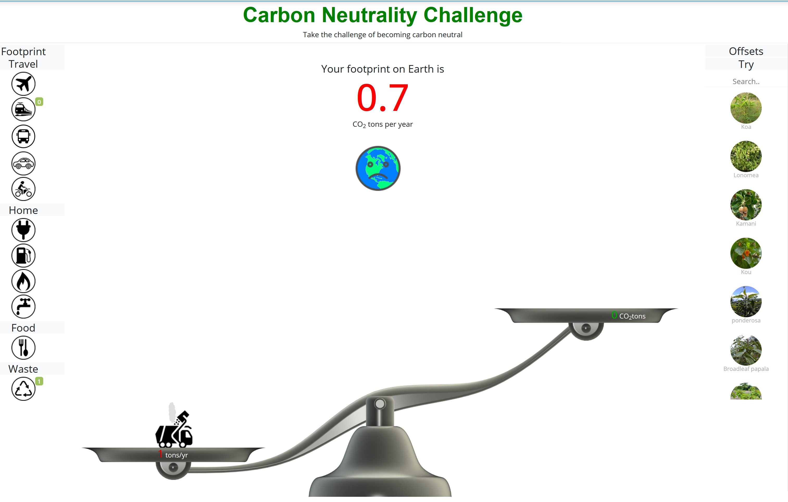
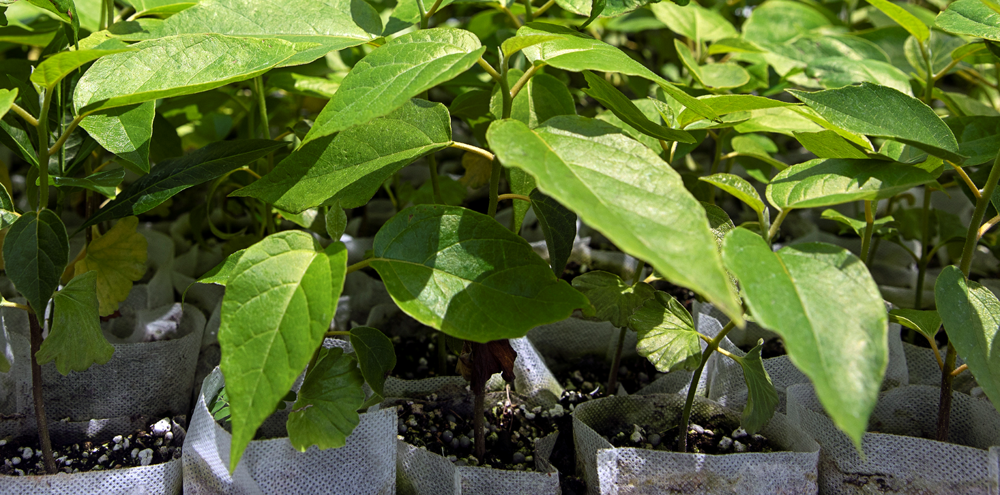
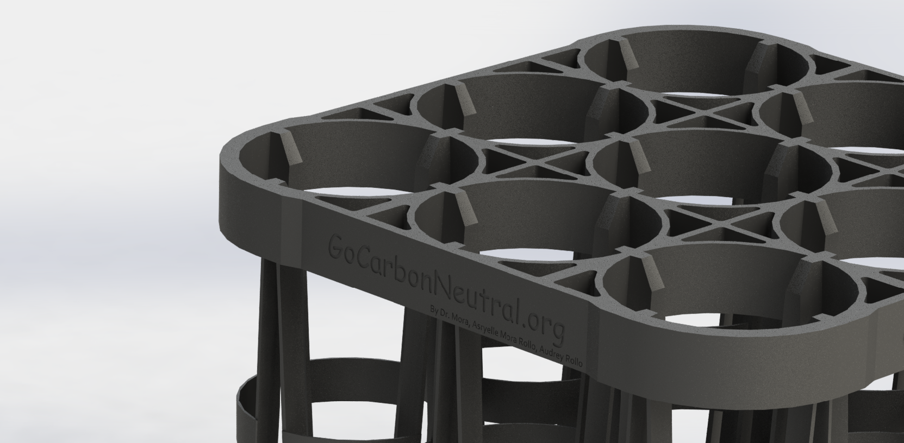
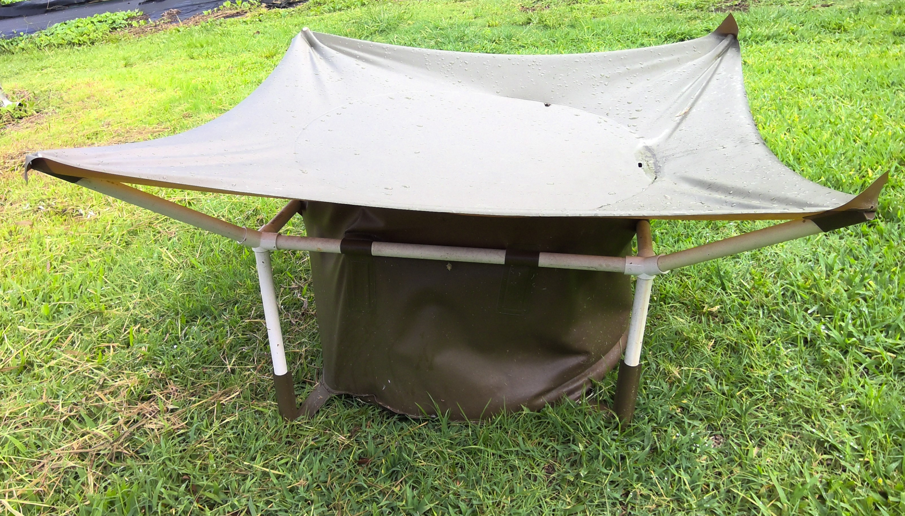
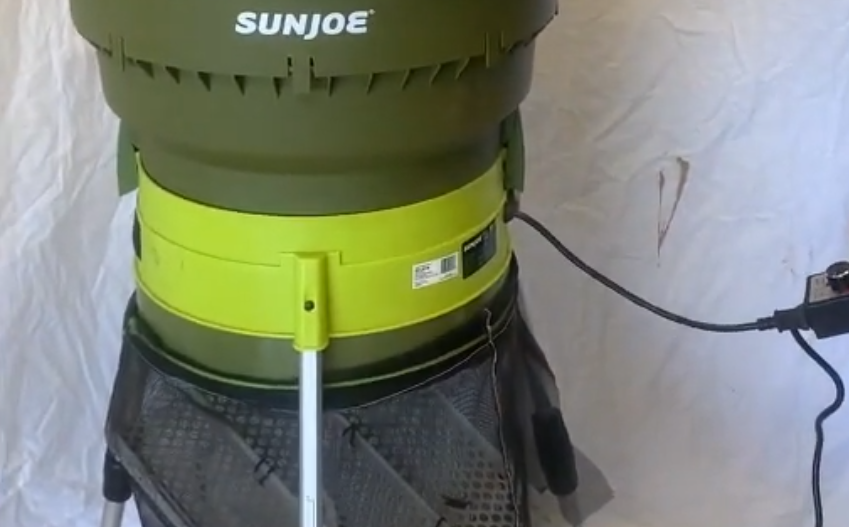
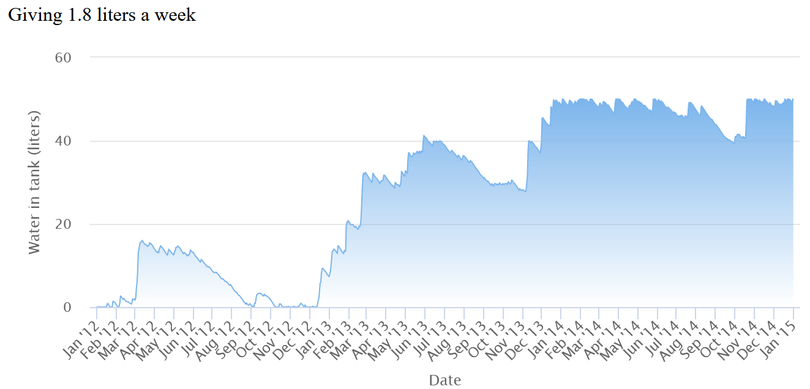

# Resources {-}

Tools, methods and codes developed by the Mora lab

  |                                                                                             |
  | :--------------------------- | :----------------------------------------------------------- |
  |    |**The Carbon Neutrality Challenge**  Interactive tool to calculate how many native trees you need to plant to offset your carbon emissions.  [URL](www.gocarbonneutral.org)                             
  |       |**Mora's sheet Pot** Development of a pot system to increase seedling quality. [URL](https://github.com/Camilo-Mora/MorasPot)                             
  |       |**Mora's tray** Tray to improve the quality of life of seedlings at the nursery. [URL](https://github.com/Camilo-Mora/Tray)                              
  |     |**RainCatcher** Affordable and re-usable device to collect rainwater for irrigation of individual trees. [URL](https://github.com/Camilo-Mora/WaterCathment)        
  |    |**KOA threshind machine**  Machine developed for the purpose of threshing thousands of koa seeds in a few minutes. [URL](https://www.youtube.com/embed/li3xDJMJ_g4)                             
  |       |**EZW10 Easy Watering 10** Electronic irrigation system that allows to customize irrigation programs for individual trees. [URL]https://camilo-mora.github.io/EZW10/)                             
  |       |**RainWater catchment calculator** Using daily rain data for any given location, the area of your catchment and your water demands, this app determines if your rain catchment will go dry. [URL](https://camilo-mora.github.io/RainCathmentCalculator/)                             
  |     |**Tree CO2 sequestration calculator** Using several published equations, this app estimates the amount of  atmospheric CO2 that can be taken and stored by a tree over its life time. [URL](https://camilo-mora.github.io/TreeCarbonSequestration/)        
  |     |**Financial algos** Compilation of algorithms for assessment of financial markets. [URL](https://camilo-mora.github.io/BookStockIndicators/index.html)        
