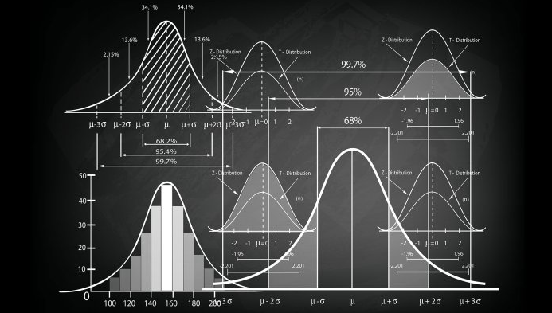
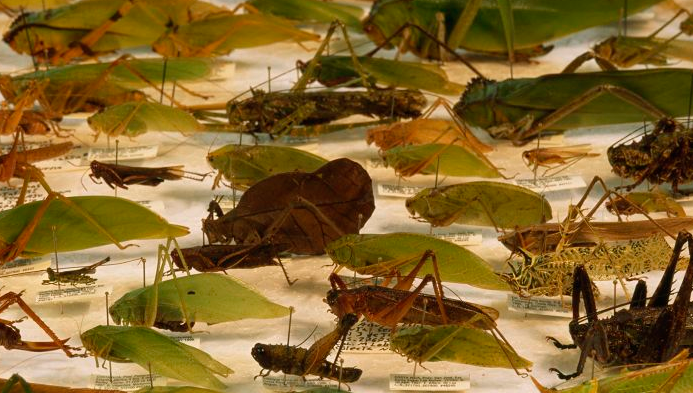

#  Welcome {-}

Welcome to the laboratory of Camilo Mora at the University of Hawaii Manoa. 

** what we do? **

Over the year we have work 

# Courses {-}

  
  |                                                                                             |
  | :--------------------------- | :----------------------------------------------------------- |
  |    |**GEO380 Statistics**  This is an introductory level course on basic statistics, and coding in R.   [URL](https://camilo-mora.github.io/GEO380/)                             |
  |       |**GEO309 Biogeography** Overview about the general patterns of the distribution of life on Earth.   [URL](https://camilo-mora.github.io/GEO309/)                             |
  |       |**GEO302 SUST314 Global Environmental Issues** Overview about humanity's assaults on nature.        [URL](https://camilo-mora.github.io/GEO302/)                             | 
  |     |**GEO710 Methods for Large Scale Analyses** How to publish high impact papers on the cheap.         [URL](https://camilo-mora.github.io/MethodsForLargeScaleAnalyses/)       | 
  

