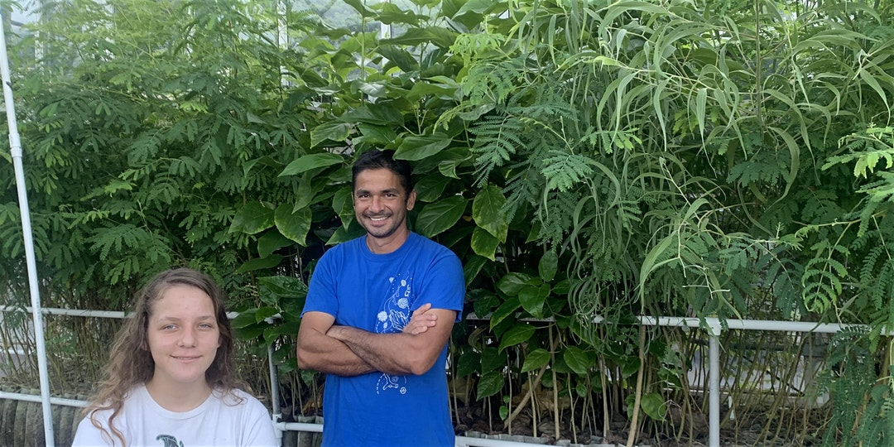

# <i>Mora</i><i>Lab</i> {-}

Over the years we have worked on reef fishes, whales, bacteria, fungi, heatwaves, cardiovascular diseases, Bitcoin, rainbows, and a few other things. What they all have in common? Numbers, lots of them.
 

My lab specializes on any problem that can be tackled with big data analytics.

Another major focus of our work is forest restoration via the Carbon Neutrality Challenge, which is a project spearheaded by my daughter Asryelle Mora, in which any individual can offset their carbon emissions by planting trees.

